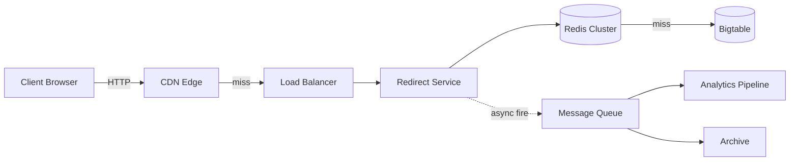
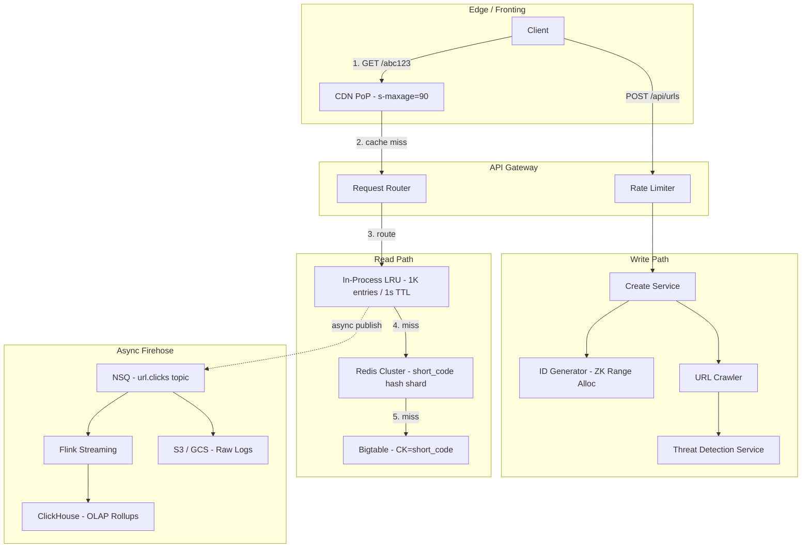

# System Design: Bitly URL Shortener

## 1. Problem frame
Bitly turns long URLs into short ones and tracks every click. At first glance this looks like a hash table with a web frontend — take a URL, generate a 7-character code, store the mapping, redirect on lookup. The hidden weight is analytics: every redirect fires an event into a pipeline that powers the business. 40 billion active links, 360 million clicks a day, peak throughput north of 200K redirects per second. The write path is light (~80 creates/sec); the read path is a firehose. The whole thing runs on ~270 backend services, and the architecture is shaped by one fact: you never block a redirect on analytics.



## 2. Requirements

### Functional
- FR1: User submits a long URL, receives a shortened version
- FR2: User clicks a short URL, gets redirected to the original destination
- FR3: User views click counts and referrer breakdowns per short link
- FR4: User creates a custom vanity short URL via an alias field
- FR5: User sets an optional expiration time on a short link
- FR6: User receives an interstitial safety warning before visiting risky destinations

### Non-functional
- NFR1: Redirect completes in under 10ms p50 measured at the server
- NFR2: System available 99.99% of the time across all regions
- NFR3: Peak throughput of 200K redirects/sec without degradation
- NFR4: Click analytics queryable within 90 seconds of the event

Out of scope: user accounts, billing, team management, QR code generation.

## 3. Back of the envelope
- 360M clicks/day ÷ 86,400s → ~4,200 req/s average, peak 200K req/s → cache hit rate must exceed 95% or the primary store melts
- 6M writes/day ÷ 86,400s → ~70 creates/s → write path is low-pressure; the ID generator is the only coordination point worth optimizing
- 40B links × ~650 bytes/link → ~26TB of row data → any single-node DB is out; distributed store with partition-per-short-code is the only path

## 4. Entities & API

```
URL
  short_code: string (PK)        ← base62-encoded ID, 7 characters
  long_url: string               ← canonicalized, max 2048 chars
  created_at: timestamp
  expires_at: timestamp          ← null = never; TTL column in Bigtable
  user_id: string (CK)           ← partition-scoped analytics grouping
  safety_status: enum            ← clean | warn | blocked

ClickEvent
  short_code: string (PK)        ← partition key for event stream
  timestamp: timestamp (CK)      ← ordering key within partition
  referrer: string | null
  user_agent: string
  geo_country: string            ← enriched by stream processor

CounterRange
  service_id: string (PK)        ← which create-service instance owns this
  range_start: int64
  range_end: int64
  current: int64                 ← monotonically increasing, in-memory
```

### API
- POST /api/urls — create a short URL; body {long_url, custom_alias?, expires_at?}
- GET /{short_code} — resolve short code to a 301 redirect to the long URL
- GET /api/urls/{short_code}/stats — click count, referrers, geo breakdown
- POST /api/urls/{short_code}/report — flag a link as potentially unsafe
- GET /api/safety/{short_code} — check safety status (clean/warn/blocked)

## 5. High-Level Design



### FR1: Create Short URL
Components: API Gateway, Create Service, ID Generator (range allocator), Threat Detection Service, Bigtable, Redis.

Flow:
1. Client POST /api/urls with {long_url, custom_alias?, expires_at?}
2. Gateway rate-limits by API key; rejects if over quota (429)
3. Create Service canonicalizes the long URL (lowercase scheme+host, strip default ports, remove fragment)
4. On custom_alias: check collision via INSERT IF NOT EXISTS on Bigtable; on conflict return 409
5. On auto-generation: call ID Generator → base62-encode the 64-bit counter value → 7-char short_code
6. Write (short_code, long_url, expires_at, user_id, safety=pending) to Bigtable
7. Warm Redis: SET url:{short_code} {long_url} EX 86400
8. Publish scan request to Crawler (async, non-blocking): Crawler fetches destination → TDS + Google Web Risk assess → Abuse API writes safety_status
9. Return 200 {short_url: "https://bit.ly/aBcDeFg", safety_status: "pending"}

### FR2: Redirect Short URL
Components: CDN Edge, Load Balancer, Redirect Service, in-process LRU, Redis Cluster, Bigtable.

Flow:
1. User clicks bit.ly/aBcDeFg → browser resolves DNS to nearest CDN PoP
2. CDN checks edge cache for aBcDeFg; on hit → returns cached 301 + Location directly (zero origin cost)
3. On CDN miss → request hits origin Load Balancer → forwarded to any Redirect Service instance
4. Redirect Service checks in-process LRU (map[short_code]url_cache); on hit → 301
5. On LRU miss → query Redis: GET url:aBcDeFg; on hit → populate LRU + 301
6. On Redis miss → query Bigtable by partition key short_code; check expires_at; return 301 or 410 Gone
7. Populate Redis (SET url:aBcDeFg {long_url} EX 86400) and LRU
8. Respond HTTP 301 Moved Permanently + Location: {long_url} + Cache-Control: private, max-age=90
9. Async fire: publish {short_code, timestamp, referrer, user_agent} to NSQ topic url.clicks

Design consideration: 301 + max-age=90 is Bitly's production choice over the more commonly cited 302. 301 tells the browser "this redirect is stable, cache it for 90 seconds." The first click in a 90s window hits origin; subsequent clicks from the same client are served from browser cache. The private directive stops intermediate proxies from caching the redirect.

### FR3: Click Analytics
Components: NSQ, Flink streaming, ClickHouse, Analytics API.

Flow:
1. Redirect Service publishes click event to NSQ topic url.clicks — fire-and-forget, zero blocking
2. Flink consumer enriches events (geo-IP lookup, device parser, bot detection filter)
3. Flink aggregates into 5-second microbatches: COUNT(*) GROUP BY short_code, hour_bucket, country, referrer_domain
4. Upsert rollups into ClickHouse click_rollups table (MergeTree, partitioned by toYYYYMM(date))
5. Analytics API (GET /api/urls/{short_code}/stats) queries pre-aggregated rollups
6. Raw events also archived to S3/GCS via separate NSQ channel for long-term cold storage

### FR4: Custom Aliases
Components: Create Service, Bigtable conditional write, Bloom filter.

Flow:
1. Client includes custom_alias: "my-brand" in POST /api/urls
2. Create Service normalizes alias (lowercase, strip non-base62 chars)
3. Check Bloom filter for likely absence — negative guarantees no collision, positive requires DB check
4. INSERT INTO urls (short_code, ...) IF NOT EXISTS — Bigtable conditional mutation
5. On collision → 409 Conflict {existing: {short_url, created_at}}
6. On success → same write+cache flow as FR1

### FR5: URL Expiration
Components: Bigtable TTL, Redirect Service expiration check, background sweeper.

Flow:
1. On create: expires_at stored in the URL row
2. On redirect: Redirect Service checks expires_at against now() at every cache-miss DB read; returns 410 Gone if expired, and publishes a tombstone to Redis (DEL url:{short_code})
3. Bigtable column-family TTL configured to auto-GC rows whose expires_at is in the past
4. CDN max-age=90 ensures stale 301s expire from edge caches within 90 seconds of a link expiring

### FR6: Safety Warnings
Components: Crawler, Threat Detection Service (TDS), Google Web Risk, Abuse API.

Flow:
1. On URL creation: Crawler is awakened async → fetches destination page, extracts title/headers/scripts
2. TDS runs internal ML classifier + heuristic rules (domain age, redirect chains, known phishing patterns)
3. Google Web Risk is queried in parallel — checks against 1M+ known unsafe URLs
4. Abuse API aggregates scores into a single safety_status: clean | warn | blocked
5. On redirect: Abuse API check at the Redirect Service level — GET abuse:{short_code} from a dedicated Redis cache (5-min TTL)
6. clean → normal 301 redirect
7. warn → interstitial page: "This link may be unsafe. [Proceed anyway] [Go back]"
8. blocked → interstitial page with no destination revealed

## 6. Deep dives

### DD1: ID Generation Strategy

**Approach: Range allocation from ZooKeeper (or etcd)**

Each create-service instance claims ranges of 1,000 IDs from ZooKeeper via atomic compareAndSet on a persistent counter node. Each instance burns through its range in-process with zero network calls on the hot path.

```
ZK path: /shortener/ranges/next
compareAndSet(current=4001, next=5001) → success
# Instance owns 4001..5000 exclusively
# In-memory: atomic.AddInt64(&localCounter, 1)
# When localCounter > rangeEnd * 0.8: async refill
```

At ~70 creates/sec, a single range lasts ~14 seconds. When 20% remains, the instance asynchronously fetches the next block. This collapses coordination traffic by 1,000× versus per-request counter increments.

The key number: at 1,000 IDs per range claim, a 3-node ZK ensemble can support 10 billion creates/day before the coordination layer becomes the bottleneck — 140,000× Bitly's current write volume.

### DD2: Redirect Flow & Latency

**Approach: Multi-layer cache pyramid**

| Layer | Tech | Hit rate | Latency |
|-------|------|----------|---------|
| L0 | CDN Edge (s-maxage=90) | 15-30% viral | 5-20ms (user RTT) |
| L1 | In-Process LRU (1K entries) | 50-65% cumulative | ~0.1ms |
| L2 | Redis Cluster (hash shard) | 92-97% cumulative | 1-2ms |
| L3 | Primary Store (Bigtable) | 100% | 5-15ms |

The in-process LRU is the sleeper layer — it costs nothing to check (~50ns in Go) and catches the common pattern of one link being clicked multiple times in rapid succession.

### DD3: Analytics Pipeline

**Approach: Fire-and-forget NSQ → Flink with 5s microbatches → ClickHouse rollups**

The redirect service publishes an event to NSQ/Kafka and immediately returns the 301. Flink enriches events, aggregates into 5-second microbatches, and upserts rollups into ClickHouse. Raw events are archived to object storage. ClickHouse stores ~10MB/day of rollup data versus ~72GB/day of raw events.

### DD4: Rate Limiting & Abuse Prevention

**Approach: Token bucket per API key + async content scanning**

Token bucket per API key (Redis-backed Lua script) for volume abuse. Async content scanning pipeline (Crawler → TDS → Google Web Risk) for targeted threats. The Abuse API result is checked on redirect from a dedicated Redis cache with 5-min TTL, adding <1ms to the redirect hot path.

## 7. Trade-offs

| Decision | Option A | Option B | Choice | Why |
|----------|----------|----------|--------|-----|
| ID generation | Central Redis counter | ZK range allocation | ZK ranges | 1000× less coordination traffic; already operate ZK |
| Redirect caching | Single Redis layer | Multi-layer (CDN+LRU+Redis) | Multi-layer | LRU costs ~0.1ms, absorbs 50%+ of hits |
| Redirect status | 302 (always hit origin) | 301 + max-age=90 | 301 + 90s | Cuts origin traffic; 90s analytics lag acceptable |
| Analytics storage | Raw events in DB | Pre-aggregated rollups | Rollups + cold archive | 10MB/day vs 72GB/day; queries run in <5ms |
| Abuse detection | Sync on create | Async on create, sync on redirect | Async + redirect check | Redirect check is <1ms; create stays fast |
